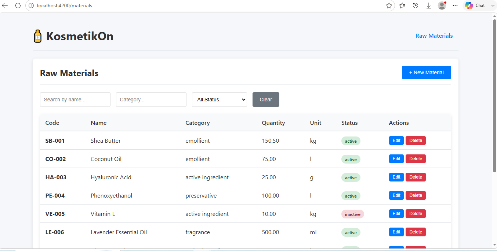
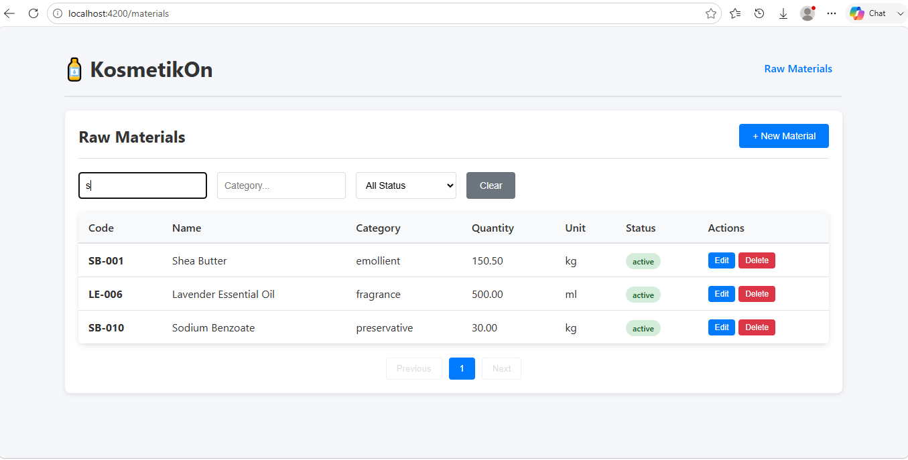
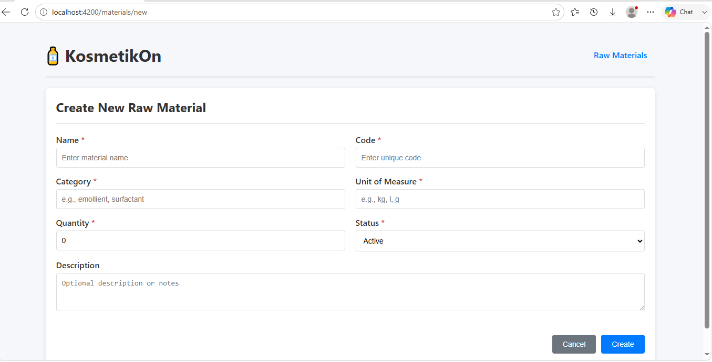
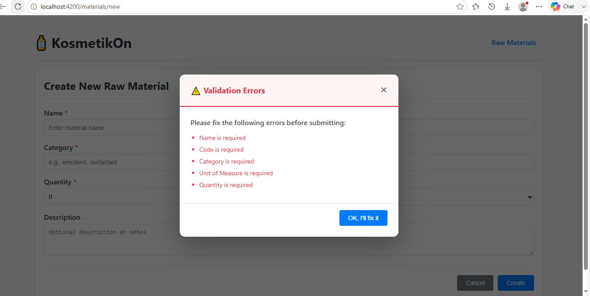
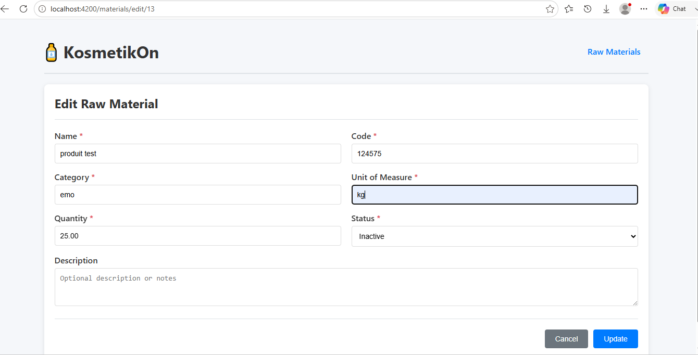

# 🧴 KosmetikOn - Raw Materials Management

A full-stack application for managing cosmetic raw materials built with Express.js, Angular, and PostgreSQL. Developed as a technical assessment for the Full Stack Developer position at KosmetikOn.

## 📋 Table of Contents

- [About The Project](#about-the-project)
- [Tech Stack](#tech-stack)
- [Features](#features)
- [Sector Knowledge Question](#sector-knowledge-question)
- [Installation](#installation)
  - [With Docker (Recommended)](#with-docker-recommended)
  - [Without Docker](#without-docker)
- [API Documentation](#api-documentation)
- [Database Schema](#database-schema)
- [Technical Decisions](#technical-decisions)
- [Project Structure](#project-structure)
- [Testing](#testing)
- [Author](#author)

## About The Project

This project implements a Raw Materials Management module for KosmetikOn, a company focused on the cosmetics industry. The application allows internal users to:

- View a list of raw materials with pagination and filters
- Create new raw materials with validation
- Edit existing raw materials
- Delete raw materials with confirmation
- Search and filter by name, category, and status

The case was intentionally kept simple (a single entity with no relationships) so the focus could be on implementation quality, clean architecture, and good development practices.

## Tech Stack

| Layer | Technology | Version |
|-------|------------|---------|
| Backend | Express.js | 5.x |
| Backend | Node.js | 18.x |
| Frontend | Angular | 17.x |
| Database | PostgreSQL | 15.x |
| ORM/Client | pg (node-postgres) | 8.x |
| Containerization | Docker & Docker Compose | - |
| API Documentation | Swagger / OpenAPI | 3.0 |

## Features

### Backend
- RESTful API with Express.js
- Layered architecture (Routes → Controllers → Services → Repositories)
- DTOs with input validation
- Centralized error handling
- PostgreSQL with pg client
- Pagination and filtering (name, category, status)
- Uniqueness validation for name and code
- Swagger/OpenAPI documentation

### Frontend
- Angular 17 with Reactive Forms
- Clean, responsive UI
- Table view with pagination
- Filters (name, category, status)
- Create and edit forms with validation
- Delete confirmation modal
- Clear error messages
- Loading states
- Validation popup showing all missing fields

### Database
- PostgreSQL with proper constraints
- Primary key, unique constraints, check constraints
- Auto-updating `updated_at` timestamp
- Indexes for performance
- Sample data (10 records)

## Sector Knowledge Question

**In your own words, what is a raw material in cosmetology?**

I have some background knowledge about products and cosmetology since I previously worked at a distribution company that handled many cleaning and drinking products. Based on that experience, and from reading the variables described in this technical test, I understand raw materials as the essential ingredients needed to form a cosmetic product and make it complete - things like water, oils, and other base components that get combined together.

Each raw material plays its own role in the final product, whether that's the base (like water or oil), something that helps the product perform its function (cleaning, moisturizing, etc.), something that keeps it safe and stable over time (preservatives), or something that adds scent. Without tracking and managing these materials properly - their quantity, category, and status - a company like KosmetikOn wouldn't be able to guarantee that a product is complete, consistent, and safe to sell. That's essentially why a system like this one matters: it keeps track of what's available and what state each material is in before it becomes part of a finished product.

## Installation

### Prerequisites

- Docker and Docker Compose (for Docker method)
- Node.js (v18+) and PostgreSQL (v15+) (for manual method)

### With Docker (Recommended)

This is the easiest way to get everything running:

```bash
# 1. Clone the repository
git clone https://github.com/zakidjellouli47/kosmetikon-test.git
cd kosmetikon-test

# 2. Start all services (database, backend, frontend)
docker-compose up --build

# 3. Access the application
# - Frontend: http://localhost:4200
# - Backend API: http://localhost:3000
# - Swagger Docs: http://localhost:3000/api-docs
```

**What happens when you run this:**
- PostgreSQL starts on port 5432 with the `kosmetikon` database
- The database schema is automatically created
- Sample data (10 materials) is seeded
- Backend API starts on port 3000
- Frontend Angular app starts on port 4200

**To stop:**
```bash
# Press Ctrl+C, then:
docker-compose down
```

**To remove everything and start fresh:**
```bash
docker-compose down -v
docker-compose up --build
```

### Without Docker

If you prefer to run locally without Docker:

**1. Setup Database**
```bash
# Create the database
createdb kosmetikon

# Run the schema and seed data
psql -d kosmetikon -f database/schema.sql
```

**2. Start Backend**
```bash
cd backend

# Install dependencies
npm install

# Start the server
npm run dev
```
Your backend will run at: `http://localhost:3000`

**3. Start Frontend**
```bash
cd frontend

# Install dependencies
npm install

# Start the Angular dev server
npm start
```
Your frontend will run at: `http://localhost:4200`

## API Documentation

The API is documented using Swagger/OpenAPI and is available when the backend is running:

```
http://localhost:3000/api-docs
```

### Endpoints

| Method | Endpoint | Description | Query Parameters |
|--------|----------|--------------|-------------------|
| GET | `/api/raw-materials` | List all materials | `page`, `limit`, `name`, `category`, `status` |
| GET | `/api/raw-materials/:id` | Get a single material | - |
| POST | `/api/raw-materials` | Create a new material | - |
| PUT | `/api/raw-materials/:id` | Update a material | - |
| DELETE | `/api/raw-materials/:id` | Delete a material | - |

### Example Requests

```bash
# Get all materials (first page, 10 items)
curl http://localhost:3000/api/raw-materials

# Get page 2 with 5 items per page
curl "http://localhost:3000/api/raw-materials?page=2&limit=5"

# Filter by category
curl "http://localhost:3000/api/raw-materials?category=emollient"

# Filter by status
curl "http://localhost:3000/api/raw-materials?status=active"

# Search by name
curl "http://localhost:3000/api/raw-materials?name=shea"

# Combined filters
curl "http://localhost:3000/api/raw-materials?category=emollient&status=active"

# Create a new material
curl -X POST http://localhost:3000/api/raw-materials \
  -H "Content-Type: application/json" \
  -d '{
    "name": "Test Material",
    "code": "TM-001",
    "category": "surfactant",
    "unitOfMeasure": "kg",
    "quantity": 10.50,
    "status": "active",
    "description": "This is a test material"
  }'

# Update a material
curl -X PUT http://localhost:3000/api/raw-materials/1 \
  -H "Content-Type: application/json" \
  -d '{
    "name": "Updated Shea Butter",
    "quantity": 200.00
  }'

# Delete a material
curl -X DELETE http://localhost:3000/api/raw-materials/11
```

### Response Format

**Success Response:**
```json
{
  "success": true,
  "data": { ... },
  "pagination": {
    "page": 1,
    "limit": 10,
    "total": 10,
    "totalPages": 1
  }
}
```

**Error Response:**
```json
{
  "success": false,
  "statusCode": 409,
  "message": "Name already exists",
  "errors": [
    {
      "field": "name",
      "message": "A material with this name already exists"
    }
  ],
  "timestamp": "2026-08-28T22:30:00.000Z"
}
```

## Database Schema

The application uses a single table called `raw_material`:

```sql
CREATE TABLE raw_material (
    id SERIAL PRIMARY KEY,
    name VARCHAR(150) NOT NULL UNIQUE,
    code VARCHAR(50) NOT NULL UNIQUE,
    category VARCHAR(80) NOT NULL,
    unit_of_measure VARCHAR(20) NOT NULL,
    quantity DECIMAL(10,2) NOT NULL DEFAULT 0,
    status VARCHAR(20) NOT NULL DEFAULT 'active',
    description TEXT,
    created_at TIMESTAMP DEFAULT CURRENT_TIMESTAMP,
    updated_at TIMESTAMP DEFAULT CURRENT_TIMESTAMP,

    CONSTRAINT chk_status CHECK (status IN ('active', 'inactive')),
    CONSTRAINT chk_quantity CHECK (quantity >= 0)
);
```

### Constraints

| Constraint | Purpose |
|------------|---------|
| `PRIMARY KEY (id)` | Unique identifier |
| `UNIQUE (name)` | Ensures no duplicate names |
| `UNIQUE (code)` | Ensures no duplicate codes |
| `CHECK (status IN (...))` | Only allows 'active' or 'inactive' |
| `CHECK (quantity >= 0)` | Prevents negative quantities |

### Indexes

| Index | Purpose |
|-------|---------|
| `idx_raw_material_name` | Faster name searches |
| `idx_raw_material_category` | Faster category filtering |
| `idx_raw_material_status` | Faster status filtering |

### Sample Data

The database comes pre-seeded with 10 sample materials:

1. Shea Butter (SB-001)
2. Coconut Oil (CO-002)
3. Hyaluronic Acid (HA-003)
4. Phenoxyethanol (PE-004)
5. Vitamin E (VE-005)
6. Lavender Essential Oil (LE-006)
7. Aloe Vera Gel (AV-007)
8. Titanium Dioxide (TD-008)
9. Jojoba Oil (JO-009)
10. Sodium Benzoate (SB-010)

## Technical Decisions

Here are some of the key decisions made during development and why:

**1. Used `pg` instead of an ORM**
The native PostgreSQL client (`pg`) was chosen over an ORM like Prisma or TypeORM. While ORMs can be convenient, for a simple single-entity module like this, the overhead wasn't justified. Using `pg` directly gives full control over the queries and keeps things lightweight and performant.

**2. Layered Architecture**
A clear separation of concerns was followed:
- **Routes**: Define API endpoints
- **Controllers**: Handle HTTP requests and responses
- **Services**: Contain business logic
- **Repositories**: Handle database operations

This makes the code more maintainable, testable, and easier to extend.

**3. DTO (Data Transfer Object) Pattern**
DTOs are used to validate incoming data before it reaches the service layer. This ensures that only valid data is processed and provides clear, consistent validation errors.

**4. Centralized Error Handling**
All errors flow through a single middleware function. This gives consistent error responses across all endpoints and keeps the code cleaner.

**5. Docker Containerization**
Docker was included to make the project easy to run on any machine. With one command (`docker-compose up`), anyone can spin up the entire stack - database, backend, and frontend - without needing to install PostgreSQL or Node.js locally.

**6. Environment Variables**
All configuration (ports, database connections) is externalized using `.env` files. This makes it easy to run the app in different environments (development, staging, production).

## Project Structure

```
kosmetikon-test/
├── backend/
│   ├── src/
│   │   ├── config/
│   │   │   ├── database.js
│   │   │   └── swagger.js
│   │   ├── controllers/
│   │   │   └── rawMaterialController.js
│   │   ├── dtos/
│   │   │   └── rawMaterialDTO.js
│   │   ├── middlewares/
│   │   │   └── errorHandler.js
│   │   ├── repositories/
│   │   │   └── rawMaterialRepository.js
│   │   ├── routes/
│   │   │   └── rawMaterialRoutes.js
│   │   ├── services/
│   │   │   └── rawMaterialService.js
│   │   └── server.js
│   ├── .env
│   ├── .dockerignore
│   ├── Dockerfile
│   └── package.json
├── frontend/
│   ├── src/
│   │   ├── app/
│   │   │   ├── components/
│   │   │   │   ├── raw-material-list/
│   │   │   │   │   ├── raw-material-list.component.ts
│   │   │   │   │   ├── raw-material-list.component.html
│   │   │   │   │   └── raw-material-list.component.css
│   │   │   │   ├── raw-material-form/
│   │   │   │   │   ├── raw-material-form.component.ts
│   │   │   │   │   ├── raw-material-form.component.html
│   │   │   │   │   └── raw-material-form.component.css
│   │   │   │   └── confirm-modal/
│   │   │   │       └── confirm-modal.component.ts
│   │   │   ├── models/
│   │   │   │   └── raw-material.model.ts
│   │   │   ├── services/
│   │   │   │   └── raw-material.service.ts
│   │   │   ├── app.module.ts
│   │   │   └── app.component.ts
│   │   ├── index.html
│   │   ├── main.ts
│   │   └── styles.css
│   ├── angular.json
│   ├── tsconfig.json
│   ├── tsconfig.app.json
│   ├── .dockerignore
│   ├── Dockerfile
│   └── package.json
├── database/
│   └── schema.sql
├── docker-compose.yml
└── README.md
```

## Testing

### Backend Testing

You can test the API using curl, Postman, or the Swagger UI:

```bash
# Health check
curl http://localhost:3000/health

# Get all materials
curl http://localhost:3000/api/raw-materials

# Get single material
curl http://localhost:3000/api/raw-materials/1
```

### Frontend Testing

1. Navigate to `http://localhost:4200`
2. Test the full CRUD flow:
   - **Create**: Click "New Material" → Fill form → Submit
   - **Read**: Browse list with filters and pagination
   - **Update**: Click "Edit" → Modify fields → Update
   - **Delete**: Click "Delete" → Confirm → Removed

### Validation Testing

To test validation, try submitting the form with empty fields:

1. Go to "New Material"
2. Click "Create" without filling anything
3. A popup will appear showing all required fields

## Screenshots

**Raw materials list with pagination and filters**


**Search and filter in action**


**Create new raw material form**


**Validation errors popup on empty submission**


**Edit raw material form (preloaded data)**


## Author

**Djellouli Zakaria**

- GitHub: [@zakidjellouli47](https://github.com/zakidjellouli47)
- Email: zakidjellouli1997@gmail.com

## Additional Notes

The test was completed within the allocated 2-day timeframe. The focus areas were:

- **Clean, maintainable code** - Following best practices and SOLID principles
- **Good user experience** - Clear error messages, loading states, and intuitive UI
- **Proper error handling** - Both backend (validation, uniqueness, database errors) and frontend (form validation, API errors)
- **Documentation** - Clear README and API documentation

While unit tests, authentication, or more advanced filtering could have been added, the priority was delivering a solid, working implementation that meets all the core requirements.